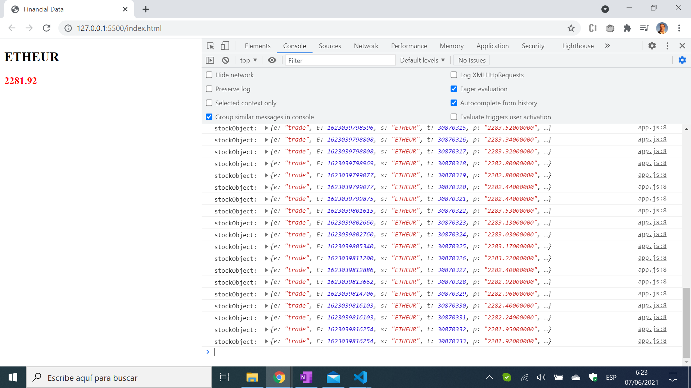

# :zap: HTML-JS-Websockets

* HTML-Javascript app using Websockets to connect to the [Binance](www.binance.com) web server and display dynamic financial data.
* * **Note:** to open web links in a new window use: _ctrl+click on link_


## :page_facing_up: Table of contents

* [General info](#general-info)
* [Screenshots](#screenshots)
* [Technologies](#technologies)
* [Setup](#setup)
* [Features](#features)
* [Status](#status)
* [Inspiration](#inspiration)
* [Contact](#contact)

## :books: General info

* Cryptocurrency data received from [Binance](www.binance.com)

## :camera: Screenshots

.

## :signal_strength: Technologies

* [HTML5](https://html.spec.whatwg.org/) markup language
* [Websockets API](https://developer.mozilla.org/en-US/docs/Web/API/WebSockets_API) communication session
* [Binance Websocket Streams](https://github.com/binance/binance-spot-api-docs/blob/master/web-socket-streams.md) base endpoint: wss://stream.binance.com:9443

## :floppy_disk: Setup

* Display the HTML file using a live server such as the [VS Code Live Server extension](https://marketplace.visualstudio.com/items?itemName=ritwickdey.LiveServer).
* The template price data updates automatically due to the Websockets communication channel [onmesssage event handler](https://developer.mozilla.org/en-US/docs/Web/API/WebSocket/onmessage).

## :computer: Code Examples

* extract from `app.js` to assign [innertext](https://developer.mozilla.org/en-US/docs/Web/API/HTMLElement/innerText) to HTML elements.

```javascript
ws1.onmessage = (event) => {
	let stockObject = JSON.parse(event.data);
	console.log("stockObject: ", stockObject);

	let name = stockObject.s;
	let price = parseFloat(stockObject.p).toFixed(2);
	stockNameElement1.innerText = name;
	stockPriceElement1.innerText = price;

	stockPriceElement1.style.color =
		!lastPrice || lastPrice === price
			? "black"
			: price > lastPrice
			? "green"
			: "red";
	lastPrice = price;
};
```

## :cool: Features

* Websockets are easy to use

## :clipboard: Status & To-do list

* Status: Working
* To-do: Expand data shown.

## :clap: Inspiration

* [Morgan Page: Real-Time Crypto Prices using the Binance API with JavaScript & Websockets](https://www.youtube.com/watch?v=XXuUNZIQUVA)

## :file_folder: License

* N/A

## :envelope: Contact

* Repo created by [ABateman](https://github.com/AndrewJBateman), email: gomezbateman@yahoo.com
